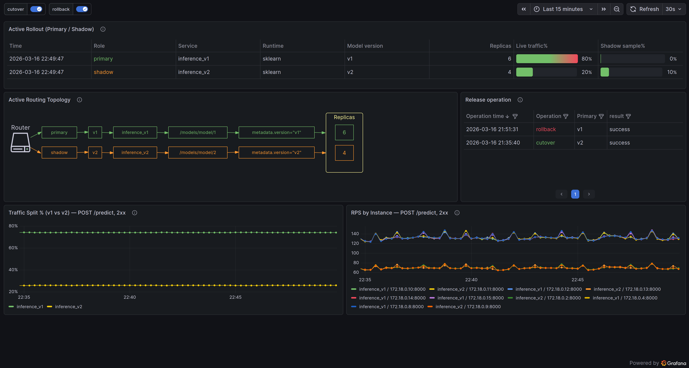
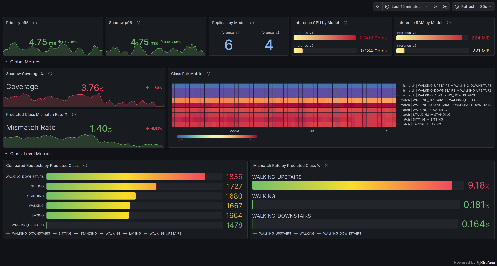

# AI Service Architecture Skeleton

An architecture skeleton for ML/AI services centered on model serving and controlled rollout. 
It separates the data plane from the control plane and supports primary/shadow model versions, traffic split, shadow mirroring, cutover and rollback, and canary-style rollout. 
The project is designed as a foundation that can be extended and adapted to different models, serving patterns, and operational environments.

## Table of Contents

- [Serving Workflow](#serving-workflow)
- [Project Layout](#project-layout)
- [Architecture Overview](#architecture-overview)
- [Operational Model](#operational-model)
- [Local Demo Flow](#local-demo-flow)
- [Observability](#observability)
- [Scope and Boundaries](#scope-and-boundaries)
- [Further Documentation](#further-documentation)

## Serving Workflow

One model version handles live traffic as the primary path, while another can run in parallel as a shadow path. Shadow evaluation can be performed either by mirroring requests for comparison or by exposing only a controlled share of live traffic to the secondary version.

Model rollout is treated as a transparent and controlled operational process. Traffic distribution, shadow participation, cutover, and rollback are explicit actions with visible state and observable effects. This makes model promotion easier to inspect, validate, and manage in a running service.

The repository also includes the supporting surface around that workflow: administrative controls, comparison logic, metrics, dashboards, and validation utilities. The emphasis is on how a model version is introduced, observed, compared, and promoted in a running service.

---

## Project Layout

```text
ai-service-skeleton/
├── .github/                              # CI and repository automation
│   ├── fixtures/                         # request fixtures used by CI smoke flows
│   └── workflows/                        # GitHub Actions pipelines
├── alertmanager/                         # alert routing configuration
├── app/                                  # inference service
├── compare/                              # primary/shadow comparison service
├── data/                                 # local data directory for helper workflows
├── docs/                                 # supporting documentation
├── gateway/                              # gateway container helpers and reload logic
├── grafana/                              # dashboards and Grafana provisioning
│   ├── dashboards/                       # dashboard JSON definitions
│   └── provisioning/                     # startup provisioning for Grafana
├── models/                               # versioned model artifacts
│   └── model/                            # model family root
│       ├── 1/                            # model version 1 artifacts
│       └── 2/                            # model version 2 artifacts
├── nginx/                                # nginx data-plane configuration
├── prometheus/                           # metrics scrape configuration and rules
├── router/                               # rollout control plane
├── scripts/                              # training/validation/operational utilities
├── state/                                # persisted rollout state
├── tests/                                # automated test coverage
├── .env.example                          # example environment configuration
├── CONTRIBUTING.md                       # contributor guidance
├── docker-compose.yml                    # local stack orchestration
├── Dockerfile                            # base image build
├── LICENSE                               # repository license
├── Makefile                              # operational entry points
├── README.md                             # repository overview
└── requirements.txt                      # runtime dependencies
```
---

## Architecture Overview

- **Gateway** is the public entry point. It accepts prediction traffic, applies the active rollout configuration, and routes requests to the appropriate model version pool.

- **Router** acts as the control plane. It manages rollout state and administrative operations, including traffic split, shadow participation, cutover, and rollback. It defines how traffic should be handled, but prediction traffic does not flow through the router.

- **Inference pools** represent two versions of the same serving line. Each version can run with multiple replicas and participate as primary, shadow, or partially exposed live traffic.

- **Compare service** receives comparison events from both serving paths and evaluates how the current primary and candidate version behave under the same request flow.

- **Observability stack** collects service, rollout, comparison, and infrastructure signals through Prometheus, Grafana, and Alertmanager.

```text
                                              +-------------------------+
                                              |     control plane       |
                                              |                         |
                                              |  router                 |
                                              |  - /info                |
                                              |  - /variants/info       |
                                              |  - /admin/*             |
                                              |  - rollout operations   |
                                              +------------+------------+
                                                           |
                                                           | reads / updates
                                                           v
                                             +---------------------------+
                                             | state/rollout_state.json  |
                                             +-------------+-------------+
                                                           |
                                                           | watched by
                                                           v
         +--------+                          +-------------+--------------+
         |        | - /predict ------------> | gateway                    |
         | Client | <- prediction response - | nginx public entry point   |
         |        |                          | + config reloader          |
         +--------+                          +------+--------------+------+
                                                    |              |
                                      live traffic  |              | shadow mirroring
                                                    |              |
                                    +---------------+              +-------------+
                                    |                                            |
                                    v                                            v
                      +-----------------------------+              +-----------------------------+
                      | inference-v1 upstream pool  |              | inference-v2 upstream pool  |
                      | replica 1                   |              | replica 1                   |
                      | replica 2                   |              | replica 2                   |
                      | ...                         |              | ...                         |
                      | replica N                   |              | replica N                   |
                      +-------------+---------------+              +-------------+---------------+
                                    |                                            |
                                    | comparison events                          | comparison events
                                    +----------------------+---------------------+
                                                           |
                                                           v
                                                +----------------------+
                                                | compare service      |
                                                | pairs primary/shadow |
                                                | outcomes             |
                                                +----------+-----------+
                                                           |
                              +----------------------------+----------------------------+
                              |                            |                            |
                              v                            v                            v
                       +--------------+            +---------------+            +---------------+
                       | Prometheus   | ---------> | Grafana       |            | Alertmanager  |
                       | scrapes      |            | dashboards    |            | alerts        |
                       +--------------+            +---------------+            +---------------+
```
---
## Operational Model

The repository is built around two model versions in the same serving line: one active version and one candidate version. At any point, one version acts as the **primary** path for live traffic, while the other can participate as a **shadow** version or as a partially exposed live candidate. This makes rollout behavior explicit and keeps promotion decisions tied to observable runtime behavior rather than to deployment alone.

The control plane defines how traffic should be handled, while the gateway enforces that behavior in the data plane. This separation allows rollout state to be changed, inspected, and reversed without pushing prediction traffic through administrative logic.

The serving workflow supports several rollout modes:

- **Primary serving**  
  The current primary version handles live prediction traffic and produces the user-visible response.

- **Shadow mirroring**  
  Requests can be mirrored to the secondary version for side-by-side evaluation without affecting the response returned to the client.

- **Controlled live exposure**  
  A defined share of live traffic can be routed to the secondary version, allowing canary-style validation under real request conditions.

- **Cutover and rollback**  
  Promotion is treated as an explicit state transition. The candidate version can be promoted to primary, and the previous primary can be restored through rollback if needed.

This model is intentionally operational rather than automated. Rollout, shadow participation, and promotion are exposed as visible actions with corresponding state and observable effects. The goal is not to hide model transitions behind deployment mechanics, but to make them inspectable, testable, and manageable as part of a running service.

---

## Local Demo Flow

A clean checkout is enough to inspect the serving path and exercise basic rollout behavior. The repository already includes model artifacts and a request fixture, so the initial demo flow does **not** depend on `data/` being populated.

> [!NOTE]
> The repository uses a mixed execution model. Most operational commands run through Docker Compose, but some helper commands still run on the host machine.
>
> - **Dockerized path:** `make up`, `make smoke`, `make load`, `make split`, `make shadow-sample`, `make cutover`, `make rollback`, and related operational targets run inside containers.
> - **Host-side path:** `make load-dataset`, `make clear-dataset`, and `make traffic` run on the host and therefore require a local Python environment with the necessary dependencies available.
>
> **Host requirements for local commands:** Python **3.11+**, `numpy`, `httpx`, and `curl`.
> 
> The basic serving flow works on a clean checkout because the repository already includes model artifacts and a prediction fixture. However, the built-in load profiles depend on payload files under `data/payloads/`. On a clean checkout those files are not present, so dashboard-populating traffic requires preparing the local data directory first.

Start the stack:

```bash
make up
```
In a second terminal, inspect the current serving state through the public gateway:
```bash
curl http://localhost:8080/info
curl http://localhost:8080/variants/info
```
Send a prediction request using the bundled fixture:
```bash
curl -X POST http://localhost:8080/predict \
  -H "Content-Type: application/json" \
  --data-binary @.github/fixtures/ci_smoke_request.json
```
Exercise one rollout step by exposing a small share of live traffic to the candidate version:
```bash
make split PCT=10
curl http://localhost:8080/info
```
You can also enable shadow mirroring without changing the user-visible response path:
```bash
make shadow-sample PCT=10
curl http://localhost:8080/info
```
The observability stack is available once the services are up:
- Gateway: http://localhost:8080
- Prometheus: http://localhost:9090
- Grafana: http://localhost:3000 (admin / admin)

If you want to populate dashboards with the built-in traffic profiles, first prepare the payload files on the host:
```bash
make load-dataset
```
Then run the traffic profile:
```bash
make smoke
```
To return the system to its default rollout state after local experiments:
```bash
make reset-state
make down
```

## Observability

The repository includes three Grafana dashboards that cover rollout state, model comparison, and infrastructure health. Together they provide visibility into how model versions are routed, how they behave under shared traffic, and how the serving pools consume runtime resources.

- **Serving and Rollout Dashboard** — shows the active primary/shadow assignment, routing topology, release operations, traffic split, and request flow across serving instances.
- **Primary/Shadow Comparison Dashboard** — shows shadow coverage, mismatch rate, class-level comparison signals, and how the candidate version behaves relative to the current primary version.
- **Infrastructure Dashboard** — shows container- and host-level CPU, memory, and runtime health for the local stack.

<table>
  <tr>
    <td></td>
    <td></td>
  </tr>
</table>

---

## Scope and Boundaries

This repository covers a focused slice of ML/AI service architecture: model serving, rollout control, primary/shadow version handling, behavioral comparison, and observability around those flows. It is designed to support transparent and controlled model rollout, promotion, rollback, and runtime inspection.

The repository is structured as an architecture skeleton that can be extended toward different models, runtimes, rollout strategies, and deployment environments. Its core separation between the data plane, control plane, comparison flow, and observability layer provides a stable base for further adaptation.

The scope remains centered on the serving side of the system. Areas such as authentication and authorization, distributed state backends, orchestration policy engines, multi-tenant isolation, and full training lifecycle management are outside this repository and can be added later according to the needs of a specific environment.

---

## Further Documentation

Additional repository details are documented in the supporting files below:

- [`docs/model-guide.md`](docs/model-guide.md) — model artifacts, serving workflow, rollout operations, and local usage notes
- [`docs/commands.md`](docs/commands.md) — command reference for build, validation, rollout, testing, and local operations
- [`CONTRIBUTING.md`](CONTRIBUTING.md) — development setup, local contribution workflow, and repository conventions

---
## License

This repository is distributed under the MIT License. See [LICENSE](LICENSE) for details.